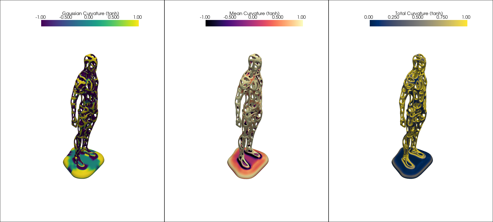
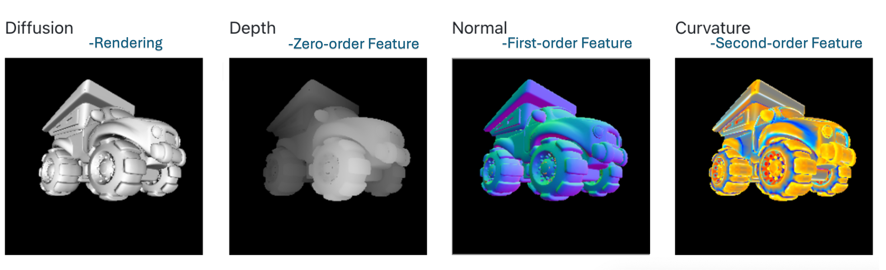
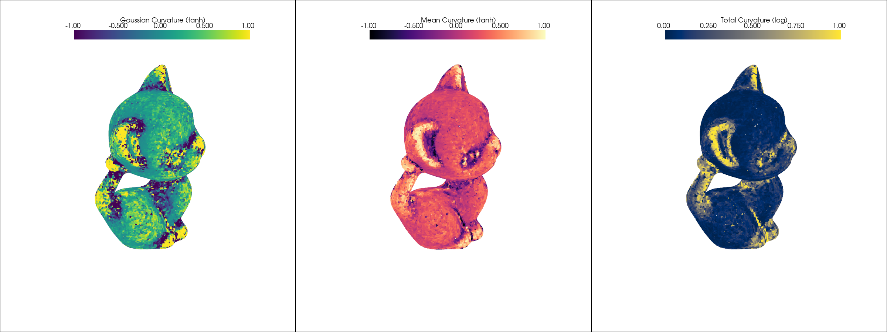

# Differentiable Curvature \& Topology
`DiffCurvature` is the official implementation of the paper [*Differentiable Topology Estimating from Curvatures for 3D Shapes*](https://arxiv.org/abs/2412.00140), developed by Yihao Luo. This project introduces a differentiable method for estimating the curvature and topological characteristics of 3D shapes across multiple representations. Entirely built in PyTorch, it seamlessly integrates with deep learning frameworks, making it the first project to provide global topological estimation of 3D shapes in an explicit and differentiable manner.



#### 🚧 To do

- [x] **2x Gaussian Curvature of Meshes**: Compute Gaussian curvature of triangular meshes via 1. the discrete Gauss-Bonnet theorem with GPU acceleration and 2. the Weingarten map with solid angle estimation.
- [x] **RGB-D Data Processing**: Differentiable rendering and processing of RGB-D data for curvature and topological estimation.

- [x] **Curvature of Pointclouds**: Estimate Gaussian and mean curvature for point clouds using a novel, stable method based on the Gaussian map and Weingarten map.
- [x] **Differentiable Voronoi Diagrams**: Compute the local area element for point clouds with differentiable Voronoi diagrams.
- [x] **Topological Estimation for Pointclouds**: Estimate topological characteristics such as the Euler characteristic and genus of surfaces.
- [x] **Support for Multiple Representations**: Supports meshes, point clouds (oriented or non-oriented), voxels, implicit functions, and Gaussian splatting.
- [x] **Batch Processing**: Process multiple meshes in parallel for curvature and topological estimation.
- [ ] Explore a zero-shot deep learning model for curvature and topological characteristic estimation.

**Note**: This project corrects several conceptual issues found in `PyTorch3D`. For instance, `pytorch3d.ops.estimate_pointcloud_local_coord_frames` incorrectly derives frames using the covariance matrix of each point in a point cloud. Find the corrected version in `ops.mesh_geometry.Differentiable_Global_Geometry_PointCloud`.


### Requirements

The core functionality depends on the following libraries:
   

For differentiable rendering:
 

For visualization and testing:
  

For better life:


*Please install the required packages according to their official guidelines (Any compatible versions should work). The `requirements.txt` just provides a reference for the core packages.*

### Getting Started
To get started, clone this repository:
```bash
git clone git@github.com:Luo-Yihao/DiffCurvature.git
cd DiffCurvature
```
Run the following command to get the rendering results of the mesh curvature:
```bash
python python render.py --mesh_path data_example/Kar.obj  --num_viewpoints 6 --image_size 256 --device cuda:0
```
By default, the multi-channel images will be saved in the results folder. The output will look similar to the example below:

The curvature map's color scheme can be easily customized in the `render.py` file.

Then run the `TUTORIAL.ipynb` notebook for a detailed guide on how to use the core functionalities of the project.


### Usage Example 

#### For Mesh

```Python
import numpy as np
import torch
import trimesh
from pytorch3d.io import load_obj
from pytorch3d.structures import Meshes
from ops.mesh_geometry import *

# Load the kitty mesh.
trg_obj = 'data_example/Kitten.obj'
# We read the target 3D model using load_obj
verts, faces, aux = load_obj(trg_obj)
faces_idx = faces.verts_idx
verts = verts
mesh_np = trimesh.load(trg_obj)
# We construct a Meshes structure for the target mesh
trg_mesh = Meshes(verts=[verts], faces=[faces_idx])
# Dual areas of vertices
dual_areas_padded = vert_feature_packed_padded(trg_mesh, get_dual_area_vertex_packed(trg_mesh).view(-1,1))
# gaussian curvature of the vertices and topological characteristics
curvature_vertex_packed = get_gaussian_curvature_vertices_from_face_packed(trg_mesh).view(-1,1)
curvature_vertex_padded = vert_feature_packed_padded(trg_mesh, curvature_vertex_packed.view(-1,1))
diff_euler = (curvature_vertex_padded*dual_areas_padded).sum(dim=1).view(-1)/2/np.pi
diff_genus = 1 - diff_euler/2
# discrete Gauss-Bonnet theorem
print("Gauss-Bonnet theorem: integral of gaussian_curvature - 2*pi*X = ",diff_euler.cpu().numpy() - 2*np.pi*mesh_np.euler_number)
```
The results come as follows and visualization is shown in the top image:
```
Gauss-Bonnet theorem: integral of gaussian_curvature - 2*pi*X =  0.000017
```

#### For PointCloud
Get the curvature and topological characteristics of point clouds:


```Python
num_samples = 10000 # 100000 
pointscloud, normals_gt = sample_points_from_meshes(trg_mesh, num_samples, return_normals=True)
k = 50 # number of nearest neighbors
Weingarten_fields, normals_field, tangent1_field, tangent2_field = Weingarten_maps(pointscloud,k)
# construct the principal frame by principal curved directions and normals
principal_curvatures, principal_direction, normals_field =  Curvature_pcl(pointscloud,k,return_princpals=True)
principal_frame = torch.cat([principal_direction,normals_field[:,:,None,:]],dim=-2)
## Estimate the Topological characteristics with various k neighborhoods (for stableness test)
for i in range(5,10):
    pcl_with_frames = Differentiable_Global_Geometry_PointCloud(pointscloud, k = 5*i, normals = None) # = normals_gt
    print('Estimated Genus',  1-torch.round(pcl_with_frames.differentiable_euler_number()[0]/2).item())

    print('Estimated euler',  pcl_with_frames.differentiable_euler_number()[0].item())
```
The results come as follows and visualization is shown in the top image:
```
Estimated Genus 1.0
Estimated euler -0.27381613850593567
Estimated Genus 1.0
Estimated euler -0.17997273802757263
Estimated Genus 1.0
Estimated euler -0.10879017412662506
...
```
### Mathematical Principles

The Gaussian map is a mapping that transforms each point on a surface to a point on the unit sphere. The Weingarten map, the differential of the Gaussian map, transforms each tangent vector on a surface to the tangent vector of the unit sphere linearly. Due to the two tangent spaces coinciding, the Weingarten map can be represented as a $2\times2$ matrix field.  The curvature at a point on the surface can be computed using the Weingarten map as follows:

Let $N:M\to S^2$ be the unit normal vector at the point.
Let $dN: T_p(M)\to T_{N(p)}S^2$ be Weingarten map, written as $W(p)$. Here the differential and stable estimation of the Weingarten map is non-trivial, where we involved an algorithm to solve the Sylvester equation to achieve the Hermitian solution of the Weingarten map.

The Gaussian curvature can then be computed as $K_p = \det(W(p))$ and the Mean curvature equals to $H_p = {\frac{1}{2}}{\rm Tr}(W(p))$.

The Gauss-Bonnet theorem unveils the deep connection between the local geometry and global topology, which says the integral of Gaussian curvature giving the Euler characteristics of a closed surface: 
$$\int_M KdA = 2\pi* \chi,$$
where $dA$, the local area element, is estimated by differentiable Voronoi diagram conducted on local tangent spaces of each K-nearest neighborhood.

### Contact
For any questions or comments, feel free to contact Yihao Luo at email y.luo23@imperial.ac.uk.

### Citation
If you find this project useful, please cite the following paper:
```
@article{luo2024differentiable,
  title={Differentiable Topology Estimating from Curvatures for 3D Shapes},
  author={Luo, Yihao},
  journal={arXiv preprint arXiv:2412.00140},
  year={2024}
}
```